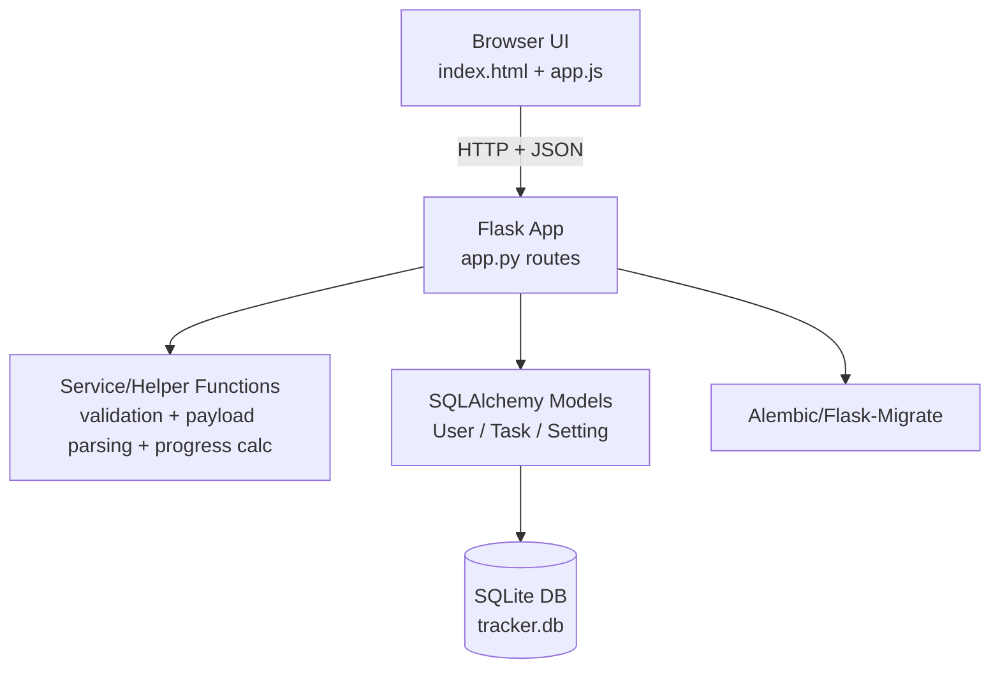
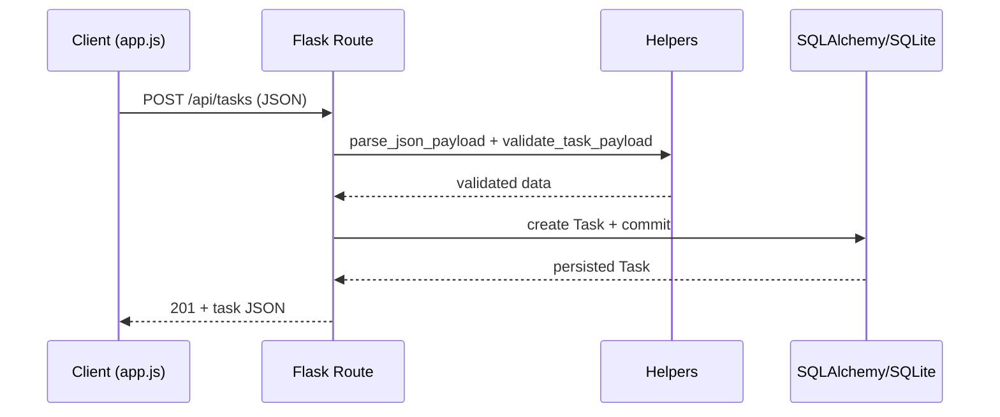

# CSIR NET Mathematics Task Tracker (Flask)

[](https://github.com/YOUR_GITHUB_USERNAME/task_tracker/actions/workflows/lint.yml)
[](https://github.com/YOUR_GITHUB_USERNAME/task_tracker/actions/workflows/tests.yml)
[](https://github.com/YOUR_GITHUB_USERNAME/task_tracker/actions/workflows/format.yml)

A full-featured study planner and task tracker tailored to the **CSIR NET Mathematics** syllabus.

> Note: Replace `YOUR_GITHUB_USERNAME/task_tracker` in badge links with your actual GitHub repository path.

---

## Project Overview

This project is a Flask-based web app that helps learners plan and track preparation for the CSIR NET Mathematics exam. It combines:

- **Authentication** (register/login/logout)
- **Task management** (create, update, complete, delete)
- **Progress analytics** (completion rate, pending work, unit-wise breakdown)
- **Exam planning settings** (exam date, daily goal, theme)
- **Preloaded syllabus structure** for CSIR NET Mathematics units/topics

The application uses a server-rendered HTML shell (`templates/index.html`) and a JavaScript client (`static/js/app.js`) that consumes JSON APIs exposed by Flask routes.

---

## Feature List

- User registration and login with password hashing.
- Session-based authentication for API access control.
- Per-user data isolation for tasks and settings.
- Task fields: title, unit, topic, priority, due date, notes, completed state.
- Validation for task payloads and date formats (`YYYY-MM-DD`).
- Progress dashboard with:
  - total / completed / pending task counters
  - completion percentage
  - unit-level completion breakdown
  - countdown (`days_left`) to exam date
- Persisted user settings:
  - exam date
  - daily goal
  - theme
- Built-in CSIR NET Mathematics syllabus map for structured task creation.
- Database migrations with Flask-Migrate/Alembic.

---

## Setup Instructions

### 1) Prerequisites

- Python 3.10+ recommended
- `pip`
- Virtual environment tooling (`venv`)

### 2) Clone and enter the project

```bash
git clone https://github.com/<your-username>/task_tracker.git
cd task_tracker
```

### 3) Create and activate a virtual environment

```bash
python -m venv .venv
source .venv/bin/activate
```

### 4) Install dependencies

```bash
pip install -r requirements.txt
```

### 5) Apply database migrations

```bash
flask --app app db upgrade
```

---

## How to Run Locally

Start the development server:

```bash
python main.py
```

Then open:

- `http://localhost:5000`

Alternative Flask CLI run command:

```bash
flask --app app run --debug --host 0.0.0.0 --port 5000
```

---

## API Documentation

Base URL (local): `http://localhost:5000`

### Auth APIs

#### `GET /api/me`
Returns current session user.

**Response (200):**
```json
{
  "user": { "id": 1, "username": "alice" }
}
```

#### `POST /api/register`
Create a user and start session.

**Request:**
```json
{
  "username": "alice",
  "password": "strong-password"
}
```

**Responses:**
- `201` created
- `400` missing username/password
- `409` duplicate username

#### `POST /api/login`
Log in existing user.

**Request:**
```json
{
  "username": "alice",
  "password": "strong-password"
}
```

**Responses:**
- `200` success
- `401` invalid credentials

#### `POST /api/logout`
Clears session.

**Response (200):**
```json
{ "ok": true }
```

---

### Task APIs (authentication required)

#### `GET /api/tasks`
List current user's tasks (newest first).

**Response (200):**
```json
{
  "tasks": [
    {
      "id": 1,
      "title": "Revise eigenvalues",
      "unit": "Linear Algebra",
      "topic": "Eigenvalues, eigenvectors and diagonalization",
      "priority": "High",
      "due_date": "2026-03-15",
      "notes": "Practice 15 problems",
      "completed": false,
      "created_at": "2026-02-26T16:00:00"
    }
  ]
}
```

#### `POST /api/tasks`
Create a task.

**Request:**
```json
{
  "title": "Solve PDE sheet",
  "unit": "Partial Differential Equations",
  "topic": "Laplace, wave and heat equations",
  "priority": "Medium",
  "due_date": "2026-03-18",
  "notes": "Focus on boundary value problems"
}
```

**Responses:**
- `201` created
- `400` validation error / malformed JSON

#### `PATCH /api/tasks/<task_id>`
Partial update task fields (`title`, `unit`, `topic`, `completed`, `priority`, `due_date`, `notes`).

**Request:**
```json
{
  "completed": true,
  "notes": "Completed with full derivations"
}
```

**Responses:**
- `200` updated
- `400` validation error
- `404` task not found

#### `DELETE /api/tasks/<task_id>`
Delete a task.

**Responses:**
- `200` `{ "ok": true }`
- `404` task not found

---

### Settings / Bootstrap / Progress APIs (authentication required)

#### `GET /api/bootstrap`
Single-shot payload for initial page load.

**Response (200):**
```json
{
  "tasks": [],
  "settings": { "exam_date": null, "daily_goal": 3, "theme": "dark" },
  "syllabus": { "Linear Algebra": ["..."] },
  "user": { "id": 1, "username": "alice" }
}
```

#### `PUT /api/settings`
Update user settings.

**Request:**
```json
{
  "exam_date": "2026-06-20",
  "daily_goal": 4,
  "theme": "dark"
}
```

**Response (200):**
```json
{
  "exam_date": "2026-06-20",
  "daily_goal": 4,
  "theme": "dark"
}
```

#### `GET /api/progress`
Returns aggregate progress metrics.

**Response (200):**
```json
{
  "total": 20,
  "completed": 8,
  "pending": 12,
  "completion_rate": 40.0,
  "unit_breakdown": {
    "Linear Algebra": { "total": 5, "completed": 3 }
  },
  "days_left": 45
}
```

---

## Code Architecture Sketch

### High-level component view



### Request lifecycle example



### Repository structure (abridged)

```text
.
├── app.py                  # Flask app factory, models, API routes
├── main.py                 # Entry-point to run the server
├── templates/
│   └── index.html          # Main UI shell
├── static/
│   ├── css/styles.css      # UI styling
│   └── js/app.js           # Frontend logic + API calls
├── migrations/             # Alembic migration scripts/config
└── tests/                  # Route and integration tests
```

---

## Quick API usage examples

Using `curl` with cookie persistence:

```bash
# Register (stores session cookie)
curl -i -c cookies.txt -X POST http://localhost:5000/api/register \
  -H "Content-Type: application/json" \
  -d '{"username":"alice","password":"secret"}'

# Create a task (reuses cookie for auth)
curl -i -b cookies.txt -X POST http://localhost:5000/api/tasks \
  -H "Content-Type: application/json" \
  -d '{
    "title":"Revise contour integration",
    "unit":"Complex Analysis",
    "topic":"Laurent series and residue calculus",
    "priority":"High"
  }'

# Fetch progress
curl -i -b cookies.txt http://localhost:5000/api/progress
```

---

## Development Notes

- Default SQLite database file is `tracker.db` in project root.
- Date format for API payloads is `YYYY-MM-DD`.
- Allowed task priorities: `Low`, `Medium`, `High`.
- Default settings: `theme=dark`, `daily_goal=3`.

